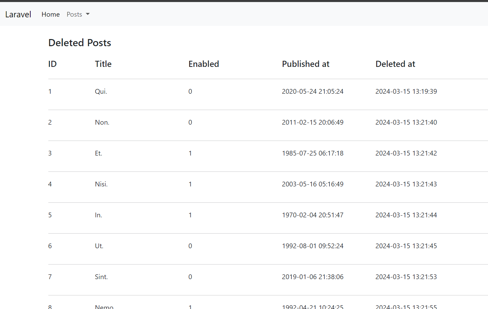

# Laravel CRUD System

Welcome to the Laravel CRUD system! This project implements basic CRUD functionality using the Laravel framework.

## Overview

This project provides a simple CRUD interface to manage resources. It includes functionality for creating, reading, updating, and deleting records in a database.

## Installation

To install and run this CRUD system locally, follow these steps:

1. Clone this repository to your local machine.
2. Navigate to the project directory.
3. Run `composer install` to install project dependencies.
4. Create a copy of the `.env.example` file and rename it to `.env`.
5. Configure your database settings in the `.env` file.
6. Run `php artisan key:generate` to generate a unique application key.
7. Run `php artisan migrate` to run database migrations.
8. Run `php artisan serve` to start the development server.

## Screenshots

### Homepage

### Create Record

### Edit Record

### Deleted Records

## Usage

Once the server is running, navigate to the provided URL in your web browser. You'll be able to perform CRUD operations on the provided resources.

## Contributing

Contributions are welcome! If you find any issues or would like to suggest improvements, please open an issue or create a pull request.
